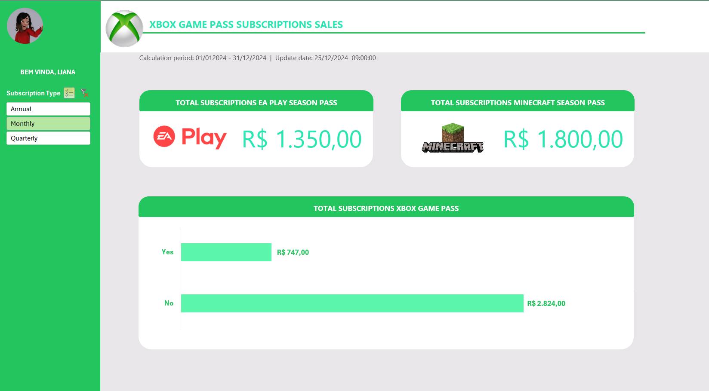

# Dashboard de Vendas – Xbox Game Pass

## Sobre o projeto

Este projeto foi desenvolvido como parte de um desafio prático da DIO, com o objetivo de criar um dashboard de vendas no Excel.

A proposta consiste em transformar dados brutos em informações visuais organizadas, facilitando a análise de desempenho e a tomada de decisões estratégicas.

O dashboard foi desenvolvido com base nas orientações das aulas, aplicando conceitos de organização de dados, uso de fórmulas e construção de visualizações gráficas.

## Objetivo
Criar um dashboard interativo no Excel para:

- Organizar dados de vendas
- Consolidar informações relevantes
- Apresentar indicadores de desempenho
- Facilitar a análise visual por meio de gráficos

## Como Visualizar

1. Baixe o arquivo .xlsx disponível neste repositório.
2. Abra no Microsoft Excel.
3. Utilize os filtros e segmentações para interagir com os dados.

## Aprendizados

Durante o desenvolvimento deste projeto, foram aplicados conceitos como:

- Organização e limpeza de dados
- Criação de tabelas dinâmicas
- Construção de dashboards
- Boas práticas de visualização de dados

## Autora

Laís Simonelli
Projeto desenvolvido como parte do desafio prático da DIO, seguindo as orientações das videoaulas da plataforma.

## Imagens do Projeto

